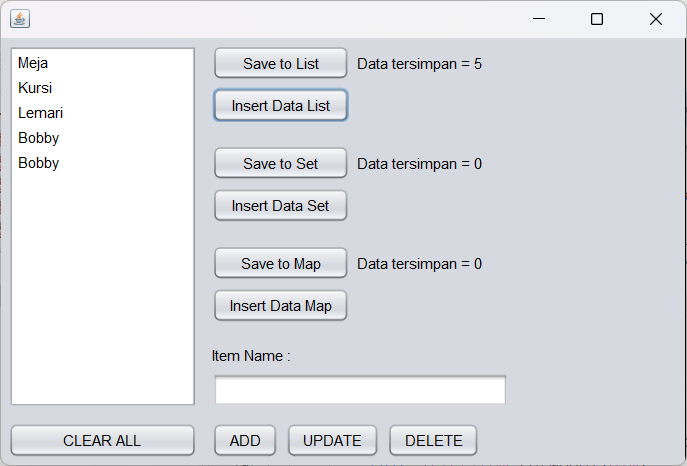
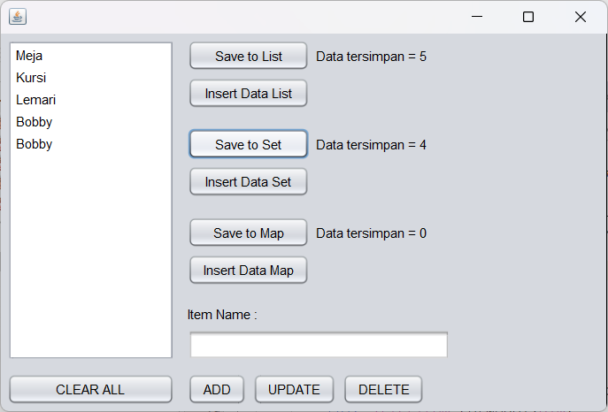
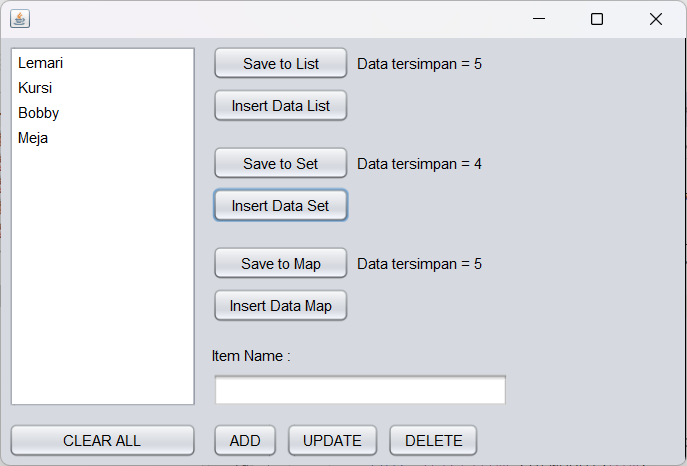
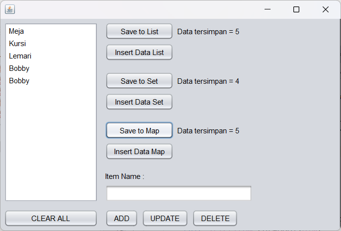

1. LIST
List adalah jenis collection yang digunakan untuk menyimpan sekumpulan data secara berurutan sesuai urutan penambahannya. Pada List, elemen yang sama (duplikat) diperbolehkan, sehingga satu nilai dapat muncul lebih dari satu kali.

Sebagai contoh, jika data "Bobby" ditambahkan beberapa kali ke dalam List, maka semua data tersebut tetap akan tersimpan.

2. SET
Set adalah collection yang digunakan untuk menyimpan data tanpa adanya elemen duplikat. Setiap nilai hanya dapat tersimpan satu kali.

Misalnya, terdapat 5 data yang dimasukkan, tetapi salah satu nilainya adalah "Bobby" yang muncul dua kali. Ketika data tersebut disimpan dalam Set jumlah data yang tersimpan hanya menjadi 4 karena nilai "Bobby" yang sama tidak akan disimpan lebih dari satu kali.
 

3. MAP
Map merupakan collection yang menyimpan data dalam bentuk pasangan key dan value.

Setiap value diakses melalui key yang unik. Pada Map, key tidak boleh memiliki duplikasi. Jika sebuah key yang sudah ada digunakan kembali, maka value lama yang terkait dengan key tersebut akan digantikan oleh value yang baru. Sehinga, setiap key hanya dapat memiliki satu value yang aktif pada suatu waktu.
